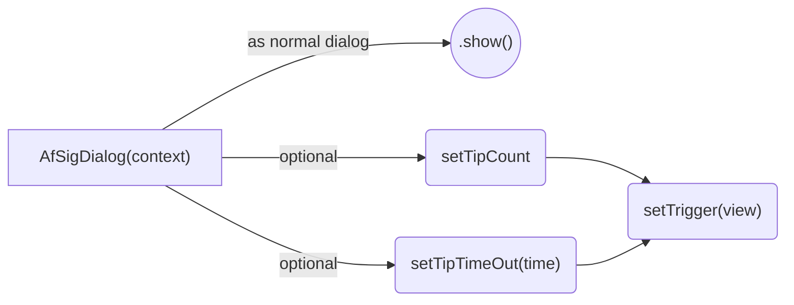

# appfarms signature dialog 

## Implementation 
1. Insert into your app build.gradle file :
```gradle 
implementation 'com.appfarms:AfSigDialog:VERSION'
```


## Usage




### Option 1
Use the dialog as normal dialog with the ```show()```function

### Option 2
Use the dialog in "trigger mode" to listen for touches on a specific view