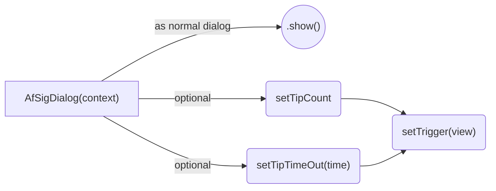

# appfarms signature dialog 

## Implementation 
0. Download the library file at : [af_sig_dialog.aar](https://gitlab.appfarms.com/timonknispel/afsigdialog-android/blob/master/afsigdialog/build/outputs/aar/afsigdialog-release.aar)
1. Right-Click on the project -> new -> Module
2. Select import .JAR/.AAR Package
3. Navigate to the downloaded .AAR file
4. Insert into your app build.gradle file :
```gradle 
implementation projekt(:"afsigdialog") 
```

## Usage




### Option 1
Use the dialog as normal dialog with the ```show()```function

### Option 2
Use the dialog in "trigger mode" to listen for touches on a specific view